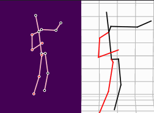

# 3D Pose Estimation Using 2D Supervision

<i>Note: This is project work done towards the completion of [16-824 Visual Learning and Recognition](https://visual-learning.cs.cmu.edu/s22/index.html). Supporting detailed report available [here](https://nihaljn.github.io/3D-Pose-Estimation). </i>

3D Pose Estimation is an important research topic with numerous applications in fields such as computer animation and action recognition. The general problem framework for 3D Pose Estimation consists of a single 2D image or a sequence of 2D images representing one or more humans as input to a model. The model outputs one 3D body represention per 2D image representing the pose of the human in that image. A common representation for a 3D person is the set of 3D coordinates of the body joints, which the model can learn to output.

In this project, we propose a 3D pose estimation framework which relies only on 2D supervision and does not assume access to 3D ground truth labels. Our results showcase that our model, trained using multi-view camera images is competitive with 3D supervised methods using single-view images at test time. If we assume multi-view images at test time, our method performs much better than 3D supervised methods on the specific examples of interest. Figure below shows an illustration of our expected inputs and outputs.

<small>Figure 1. 3D pose estimation (right) from 2D poses (left). </small>

<i>Note: The code in this repository was written hastily towards a course project deadline; it was not henceforth maintained. Nevertheless, I believe the code is runnable. If something appears broken or non-intuitive, please open an issue.</i>

## Data

The proposed method in this project is tested on two popular 3D pose estimation benchmarks below. You can also find the links to the preprocessed dataset files that are required to run the code in this repo. Please follow the instructions in the original dataset links to obtain the complete original datasets.

|Dataset|Preprocessed Link|Original Dataset Link|
|----|----|----|
HumanEva-I [1] | [Drive Link](https://drive.google.com/drive/folders/1K2aqhwkDkmFP7y40N4zzP-DxivoT2tuF?usp=share_link) | [Link](http://humaneva.is.tue.mpg.de/datasets_human_1) |
Human3.6M [2] | [Drive Link](https://drive.google.com/file/d/1AYv8HVVVA_jmU_W3LHOrnMm8n76D_61R/view?usp=share_link) | [Link](http://vision.imar.ro/human3.6m/description.php) |

## Usage

Run the following command:

`python main.py --dataset {humaneva,human36m} --method {test_time_adapt,viz,train}`

The `method` argument controls what is being run:

|Method|Description|
|----|----|
|`train`|Train a model on the `dataset`.|
|`test_time_adapt`|Perform test time adaptions on a single example from `dataset`.|
|`viz`|Visualize a single example from perspective of multiple cameras from `dataset`.|

For each `method`, modify the hyperparameters/configurations in the corresponding file before running the command above. For example, for `dataset=='humaneva and method=='test_time_adapt'`, the relevant file is `humaneva/test_time_adapt.py`.

## Method, Results, etc.

You may refer the [report](https://nihaljn.github.io/3D-Pose-Estimation) for more concrete details of this project.

## References

[1] L. Sigal, A. Balan and M. J. Black. HumanEva: Synchronized Video and Motion Capture Dataset and Baseline Algorithm for Evaluation of Articulated Human Motion, In International Journal of Computer Vision, Vol. 87 (1-2), 2010.

[2] Catalin Ionescu, Dragos Papava, Vlad Olaru and Cristian Sminchisescu, Human3.6M: Large Scale Datasets and Predictive Methods for 3D Human Sensing in Natural Environments, IEEE Transactions on Pattern Analysis and Machine Intelligence, vol. 36, No. 7, July 2014.
