# 3D Pose Estimation Using 2D Supervision

|Nihal Jain|Talha Faiz|Titas Chakraborty|
|:---:|:---:|:---:|
|nihalj@andrew.cmu.edu|mfaiz@andrew.cmu.edu|titasc@andrew.cmu.edu|

<em>Website: https://nihaljn.github.io/3D-Pose-Estimation/</em>

<em>Code: https://github.com/nihaljn/3D-Pose-Estimation/</em>

<!-- 
Motivation: Why is it important and relevant? Why should we care?
Prior Work: Briefly mention related works that are relevant to your idea instead of covering all related works.
Your idea: What is the idea?
Your idea: Why does your idea make sense intuitively?
Your idea: How does it relate to prior work in the area?
Your results: If it worked, how much did you improve?
Your results: If it did not work, why did you expect it to work?
Your results: Any negative results? Maybe you figured after trying that it did not make sense.
Summary and Conclusion
Future directions 
-->

## Introduction and Motivation

3D Pose Estimation is an important research topic with numerous applications in fields such as computer animation and action recognition. The general problem framework for 3D Pose Estimation consists of a single 2D image or a sequence of 2D images representing one or more humans as input to a model. The model outputs one 3D body represention per 2D image representing the pose of the human in that image. A common representation for a 3D person is the set of 3D coordinates of the body joints, which the model can learn to output.

Several methods exist to detect these joints in the 2D images [1, 2, 5]. If we can detect these keypoints in 2D, we only need to translate them to 3D to obtain the 3D pose. Recent work has shown that even a simple neural network model trained using 3D supervision can achieve acceptable results on this problem [1]. Some approaches have exploited temporality using the fact that in many applications, the 2D images form a video [2, 5].

These methods assume access to ground truth 3D poses which is difficult to obtain in most practical settings: it can be expensive to install equipment that can accurately track 3D poses of humans. To solve this problem, we propose a 3D pose estimation framework which relies only on 2D supervision and does not assume access to 3D ground truth labels. Our results showcase that our model, trained using multi-view camera images is competitive with 3D supervised methods using single-view images at test time. If we assume multi-view images at test time, our method performs much better than 3D supervised methods on the specific examples of interest. Figure 1 shows an illustration of our expected inputs and outputs.

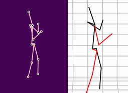

<em><strong>Figure 1. 3D pose estimation from 2D poses.</strong></em>

## Related Work

Algorithms for 3D human pose estimation from single images have seen a great interest in recent times. In this section, we discuss the recent techniques that tackle this aspect. 

There has been significant progress in the field of 3D human pose reconstruction from images in recent years [1, 2, 5]. Similar to our work, [1] attempt to estimate multi-person 3D human poses from single images. Further, [2, 5] focus on the task of reconstructing 3D human poses from video-feed data, which is directly related to the proposed problem. While they achieve really good results on the task of 3D human pose estimation, they rely on access to 3D pose annotation which is expensive to gather. We differ from these works in that we want to estimate 3D poses without using any 3D labels.

Some prior work has also attempted to perform 3D human pose estimation without using labels [10, 11]. [11] uses a complicated setup that involves projecting 3D poses to 2D via triangulations. [10] use a method that tries to jointly predict camera parameters and poses by performing bundle-adjustment using a neural refiner. [12] make use of epipolar geometry and triangulations to lift 2D poses to 3D in a self-supervised way. In contrast to these works, in this project we want to develop an intuitive strategy that can lift 2D poses to 3D without 3D supervision via a light-weight model. To enforce this, we use the simple baseline proposed in [2] as our model in most experiments.

Our work is also related to the recent works in computer vision that use weakly-supervised learning and test-time adaptation [8, 9]. We borrow the popular intuitions of reconstruction and consistency errors that have been widely used in 3D computer vision.

## Idea

In this section, we go over the details of our method and how it relates to prior work in this area.

### What is the idea?

Our approach is based on the simple idea that multiple 2D views can be obtained from a single 3D view. Concretely, if we estimate some 3D pose of a frame, we should be able to rotate (and translate) and project that 3D pose onto different views and obtain consistent 2D poses. Our model is trained using a loss function that captures this intuition. We next describe the details of our method in detail.

#### *Assumptions*

We make the following modeling assumptions in our approach:
- <strong>Our model lifts 2D poses to 3D</strong>: We assume access to 2D poses from 2D images. These are easy to obtain and recent work has achieved very high levels of performance in estimating 2D poses from 2D images [2].
- <strong>Train-time Data</strong>: We assume access to multiple views of the same frame during training. Further, we also assume access to the camera intrinsic and extrinsic parameters used to capture these different scenes at training time. In our experiments, we try two approaches: (1) takes a single frame as input at a time, (2) takes a sequence of frames as input at a time (assuming access to video-feed of poses).
- <strong>Test-time Data</strong>: We assume access to single views of the same frame during testing and no camera parameters. Further, we show in our experiments, that if indeed we have access to multiple views and camera parameters at test time, we can achieve enhanced performance on the test data.

#### *Model*

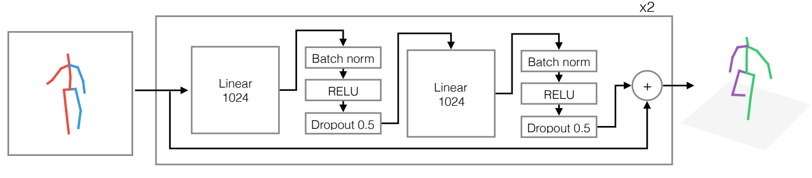

    
<em><strong>Figure 2. Model Architecture.</strong> This diagram shows our simple model architecture taken from [2]. We take 2D poses with respect to a camera as input and estimate 3D poses as output with respect to the same camera.</em>

Figure 2 shows our model with its basic building blocks. The model design is such that it takes 2D poses as inputs and produces 3D poses as outputs. This approach, adapted from [2], is based on a simple fully-connected neural network with batch normalization, dropout, Rectified Linear Units (RELUs), and residual connections [6]. There are two further layers: one to increase dimensionality to 512 just before the input to the model in the diagram, and one that projects the output of the model to get 3D poses. In our experiments we use 2 residual blocks, so we have a total of 4 linear layers.

Having obtained estimates of 3D poses using this model, we can measure the quality of the estimates using the Mean Per-Joint Position Error (MPJPE), which is a popular metric in 3D pose estimation literature, and often referred to as protocol #1 [2]. MPJPE measure the average euclidean distance between the predicted and actual coordinates of each joint in the dataset. Mathematically,

where,  are the number of examples and joints respectively, and  are the estimated pose and ground truth pose respectively. Note that the same formulation holds for poses in 3D or 2D.

We train this model using two approaches:

<strong>1. Baseline.</strong> We follow the same approach as in [2], assuming access to 3D labels while training. This approach trains the model to minimize the MPJPE between the predicted 3D poses and the ground truth 3D poses.

<strong>2. Without labels (ours).</strong> We would like to train this model without using any 3D supervision. Our proposed method relies on access to multiview 2D poses of the same scene. Thus, treating multiview 2D poses as input, we obtain multiview 3D pose estimates using our model. We train our model to ensure that these multiview 3D poses are consistent with respect to each other. Formally, we assume access to 2D poses with respect to 3 cameras , denoted as . Let the estimatated 3D pose with respect to  be  where  is our model. Since we have access to the pose in 3D, we can rotate (and translate) the pose and obtain the 2D pose with respect to some other camera. Let  denote the estimated 2D pose with respect to  obtained by rotating and projecting . This procedure is shown visually in figure 3.

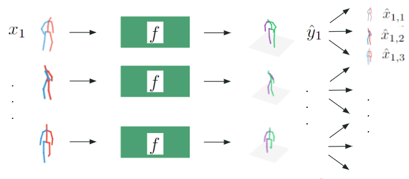

<em><strong>Figure 3. Model training procedure.</strong> We obtain estimates of 3D poses with respect to a particular camera, and rotate (and translate) and project the 3D pose to obtain 2D poses with respect to different views. Our model is trained to ensure consistency across the different views.</em>

#### *Loss*

Here we discuss the loss function used to train the model using our approach shown above.

Having obtained 2D pose estimates with respect to different views (a total of 9 2D pose estimates for 3 cameras), we train our model using the following loss:

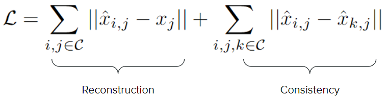

Here, the first reconstruction term ensures that the estimated 2D poses after rotation and project match the ground truth 2D poses with respect to the target view. The second consistency terms enforces the model to learn 3D poses that are consistent with respect to the rotation and projection operations. We use differentiable versions of rotation and projection functions [1] such that we can compute gradients of this loss function with repect to model weights and perform gradient descent.

Note that this training method does not use ground truth 3D labels and only uses annotated 2D poses of the same frame with respect to different views.

#### *Test Time Adaptation*

In addition to training the model on the training data using our method, we can also train the model on the test data at test time to achieve enhanced performance on the test examples of interest. This is possible because our method does not rely on ground-truth labels for lifting 2D poses to 3D. This enhanced performance would be limited to the test data at hand and wouldn't generalize to other unseen examples. Nevertheless, we show in our experiments that we can achieve really good performance on the test set examples in the datasets we use.

#### *Aside: Towards Sequence Modeling*

So far we have only discussed single-frame models for 3D pose estimation. Current state-of-the-art methods such as [5] use multi-frame sequence models that leverage temporality to achieve enhanced performance on 3D pose estimation. Taking inspiration from these methods and leveraging the video feed data available in the datasets used by us, we attempted at performing 3D pose estimation using 2D pose sequences as input. Concretely, our sequence model takes a sequence of 2D poses as input and produces a sequence of 3D poses as output.

Since transformer models [7] have shown amazing performance in sequence modeling tasks, we attempt to use a transformer-based model for our problem. Our sequence model embeds each frame in a sequence of 2D poses to an embedding space. Then a transformer encoder encodes these embeddings using multi-head self-attention to produce embeddings which are processed by a decoder block (not transformer based) to obtain a sequence of 3D poses. Just like the model above, we can train this sequence model using the loss function and method proposed above. For exact details of this model architecture, please refer our code.

While we show preliminary results on these experiments, due to time constraints, we do not tune this model or experiment with it rigorously. We leave further experimentation in this direction for our future steps.

### Why does it make sense? How does it relate to prior work?

Our approach is based on the simple idea that multiple 2D views can be obtained from a single 3D view. We assume that if the model can learn to predict consistent multiview 3D poses of the same scene independently, then it will have learned to lift 2D poses to 3D in general. 

While 3D pose estimation is often done using 3D supervision, our method which relies on the above idea does not require 3D supervision. Our method of unsupervised training via rotation and projection is inspired from recent works in 3D computer vision [8]. Further, methods that perform test time adaptation are also popular among contemporary computer vision efforts [9]. However, to the best of our knowledge, these methods are unexplored for 3D human pose estimation.

## Experiments

In this section, we go over some of the implementation and data details of our project to ensure reproducibility.

### Data

We run our experiments on two popular benchmark datasets for 3D pose estimation:

<strong>1. HumanEva-I [3]</strong>. This is a small publicly available dataset that is very popular for human 3D pose estimation. It has been largely used for benchmarking the 3D pose estimation task over the last couple decades. We use the subjects `[Train/S1, Train/S2, Train/S3]` for training and `[Validate/S1, Validate/S2, Validate/S3]` for testing. Further, we restrict our experiments to the actions of `[Walk, Jog, Box]` on this data. This dataset has mocap data from 3 cameras and we use all 3 in our experiments.

<strong>2. Human3.6M [4]</strong>. This is a large publicly available dataset for human 3D pose estimation. It contains 3.6 million images featuring 7  actors performing 15 ordinary actions such as walking, eating, sitting, and so on. Further, 2D joint locations and 3D ground truth positions are available, as well as projection (camera) parameters and body proportions for all the actors. We follow [2] in that, we use subjects `[S1, S5, S6, S7, S8]` for training and `[S9, S11]` for testing. However, due to the scale of the data we restrict our experiments only to the actions of `[Walking, Greeting, Smoking, Sitting]` for both training and testing. As a result of this, we train our models on less than 1/5 the size of data used by others. This dataset has mocap data from 4 cameras and we use 3 in our experiments (`[cam_0, cam_1, cam_2]`).

All the pose coordinate estimates for each dataset are taken to be in meters. However, we report the results in the following sections in millimeters as is the trend [1, 2, 5].

### Model Training

Our model takes inputs of shape `(N, J, 2)` and produces outputs of shape `(N, J, 3)` where `N` is the batch-size and `J` is `15` for HumanEva-I and `17` for Human3.6M. As described above, the model has 2 residual blocks and 2 other linear layers for pre- and post- processing.

Since the pretrained models for the basline was unavailable we trained the model using the baseline approach that uses 3D labels as well. For HumanEva-I we train the baseline and our model for 150 epochs. For Human3.6M we train the baseline model for 100 epochs and due to time constraints, our model for 25 epochs. We used the Adam optimizer with a learning rate of `3e-4` across all our experiments.

The baseline model is trained to minimize the MPJPE while our model is trained to minimize the proposed loss function above. However, across all experiments we track our model training by measuring the MPJPE as the validation metric on the validation set.

During our experiments, we observed that training with Dropout activated to `0.5` for `T/2` number of epochs gives much better performance than both training with and without dropout for `T` epochs. We show the validation loss of these variants while training our model on the HumanEva-I dataset in figure 4.

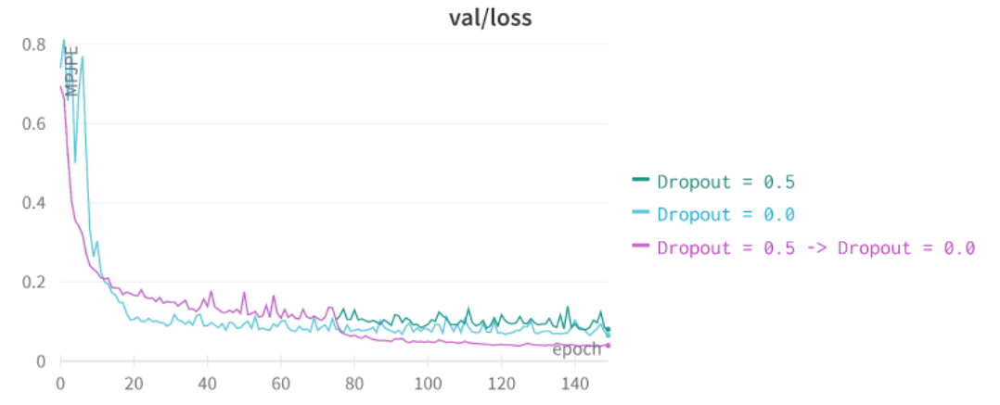

<em><strong>Figure 4. Validation Loss v/s Epoch for different training strategies with dropout.</strong> Training with dropout activated for half the number of epochs gives much better performance than other strategies. The purple curve traces a sharp drop after dropout was deactivated after epoch 75. Note purple and green curve overlap till epoch 75.</em>

## Results

### Quantitative Results

|Method|HumanEva-I (mm)|Human3.6M (mm)|
|:----|:----:|:----:|
|Baseline (with 3D labels) [2] |24.48|49.12 [100 epochs]|
|Ours (without labels)   Dropout = 0.0|65.22|-|
|Ours (without labels)   Dropout = 0.5|80.07|-|
|Ours (without labels)   Dropout = 0.5 -> 0.0|**39.67**|**67.32** [20 epochs]|
|Ours + Sequence Model|88.49|-|
|Ours + Test Time Adaptation|**7.55** [200 epochs]|**30.23** [5 epochs]|

<em><strong>Table 1. Quantitative results.</strong> Each cell shows the MPJPE metric (protocol #1) measured in millimeters. Unless otherwise indicated, each setup was trained for 150 epochs. We skipped some experiments on Human3.6M and trained inconsistently due to compute and time constraints. </em>

Table 1 shows the quantitative results obtained for our experiments on the two different datasets. We make the following observations:

1. As stated in the previous section, the setup where we deactivate dropout after training for `T/2` number of epochs seems to be performing much better than the other variants. We believe this is because training with dropout helps the model achieve a good local minima via regularization, reaching which we should allow the optimization to exploit the minima by deactivating dropout henceforth.
2. Our method performs slightly worse than the baseline approach. However, we believe that we perform well because (a) the baseline model has access to 3D labels while training whereas we assume no access to 3D supervision anywhere, and (b) while at train time our model assumes access to multi-view information, at test time our model is also a single-view model like the baseline making it a fair comparison.
3. If we assume access to multiple views and camera information at test time, training the model on the test data helps in achieving significantly enhanced performance on the test data. While this is expected because we are training on the test data, we note this is possible because our method does not require labels. A caveat to this is that, this cannot be extended to a setup where real-time 3D pose estimation is necessary because training the model on the test data cannot happen on the fly.
4. We were unable to perform rigourous experiments on Human3.6M dataset because (1) it was hard to obtain in time due to unresponsiveness of the dataset authors and (2) the dataset is much bigger than HumanEva-I making it computationally challenging for us to run experiments.
5. Our transformer-based sequence model fails to perform well. However, since it is a multi-frame model we would expect it to perform better than the other single-frame models. We believe that this model fails because (1) due to time constraints we do not tune this model very rigorously; during experiments we observed that this model is very sensitive to hyperparameters, so further tuning may improve performance, and (2) the current model architecture used by us involves multi-head self-attention only in the encoding stage -- incorporating attention in the decoding phase may further improve performance.

### Qualitative Results

In this section we present and analyze some qualitative results on each dataset.

#### **HumanEva-I**

|Input|Baseline|Ours|Ours + TTA|Ground Truth|
|---|---|---|---|---|
|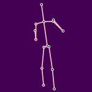|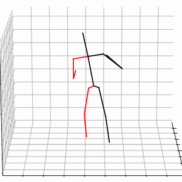|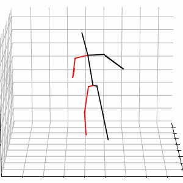|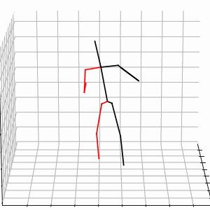|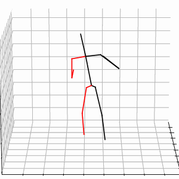|
|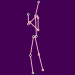|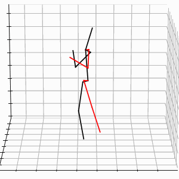|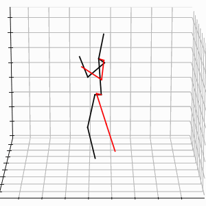|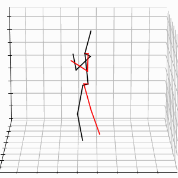|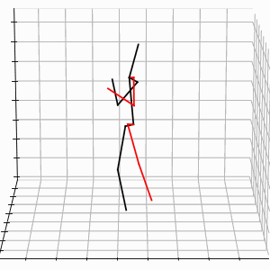|

While numerically these results differ a lot, qualitatively these results look satisfactory with very little difference between estimates and ground truths.

#### **Human3.6M**

|Input|Baseline|Ours|Ours + TTA|Ground Truth|
|---|---|---|---|---|
|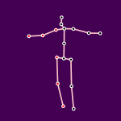|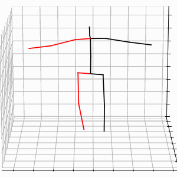|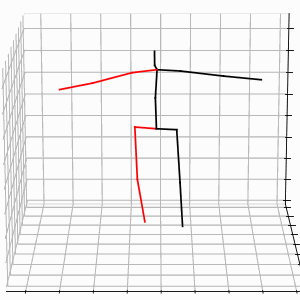|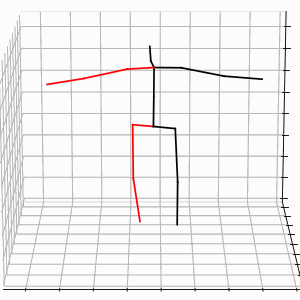|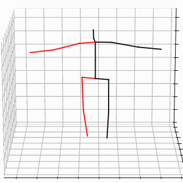|
|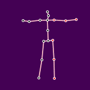|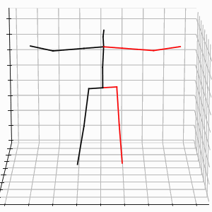|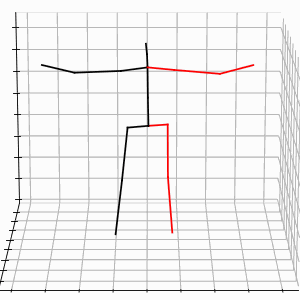|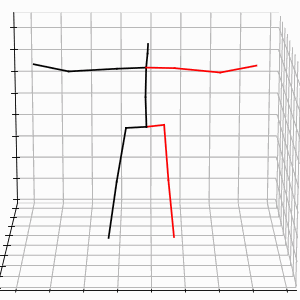|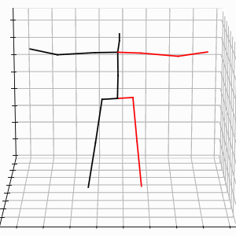|

Here the flaws in the model predictions are more apparent. The neck, arm and knee joints are clearly off in the second example. We believe that training the model for more epochs will lead to better performance because we didn't perform early stopping for this dataset -- we had to stop training due to computational and time constraints. However, the predictions with test time adaptation are much enhanced.

## Conclusion and Future Directions

3D computer vision has recently seen increasing popularity due to the rise of self-driving cars, AR/VR applications etc. This makes 3D computer vision problems like 3D human pose estimation very crucial. However, obtaining 3D annotations for human poses is expensive and cumbersome. Towards resolving this problem, in this project, we have explored estimating 3D poses without using any labels. From our proposed approach that involves rotation and projection of 3D human poses, we have shown we can achieve competitive performance when compared to methods that use 3D supervision. Further, since we do not require labels, we can train our model on test examples of interest and achieve enhanced performance on them.

We note here that we have proposed a model that is single-frame and single-view (without test time adaptation) and single-frame and multi-view (with test time adaptation). Contemporary state-of-the-art methods such as [5, 13] use multi-frame models that leverage sequence information. While we performed initial experiments using a sequence model, we expect it to perform better than the other methods. We have identified potential pitfalls in our intial experiments as discussed above, and we aim to work towards rectifying them. We summarize our results in context of current state-of-the-art methods in table 2.

|Method|HumanEva-I (mm)|Human3.6M (mm)|
|:----|:----:|:----:|
|Ours   Single frame + Single view|39.67|67.32 [20 epochs]|
|Ours + Test Time Adaptation   Single frame + Multi view|7.55 [200 epochs]|30.23 [5 epochs]|
|Ours + Sequence Model   Multi frame + Single view|88.49|-|
|StridedTransformer [5]   Multi frame + Single view|12.2|43.7|
|TesseTrack [13]   Multi frame + Multi view|-|18.7|

<em><strong>Table 2. Comparison with state-of-the-art.</strong> While our single-frame model achieves competitive performance, our multi-frame model does not do well.</em>

Further, our method requires access to camera information which can be cumbersome to obtain and is often called upon as a critique of such methods. Towards mitigating these issues, we can explore the following future directions:

(1) Obtaining enhanced performance using multi-frame models: we can leverage the recent success of transformer models that process sequence data using self-attention by resolving the issues with our attempts identified above.

(2) We can treat the camera properties as learnable parameters and have the model estimate these while training.

## References

[1] Pavllo, Dario, et al. "3d human pose estimation in video with temporal convolutions and semi-supervised training." Proceedings of the IEEE/CVF Conference on Computer Vision and Pattern Recognition. 2019.

[2] Martinez, Julieta, et al. "A simple yet effective baseline for 3d human pose estimation." Proceedings of the IEEE international conference on computer vision. 2017.

[3] Sigal, Leonid, Alexandru O. Balan, and Michael J. Black. "Humaneva: Synchronized video and motion capture dataset and baseline algorithm for evaluation of articulated human motion." International journal of computer vision 87.1 (2010): 4-27.

[4] Ionescu, Catalin, et al. "Human3. 6m: Large scale datasets and predictive methods for 3d human sensing in natural environments." IEEE transactions on pattern analysis and machine intelligence 36.7 (2013): 1325-1339.

[5] W. Li, H. Liu, R. Ding, M. Liu, P. Wang and W. Yang, "Exploiting Temporal Contexts with Strided Transformer for 3D Human Pose Estimation," in IEEE Transactions on Multimedia, doi: 10.1109/TMM.2022.3141231.

[6] He, Kaiming, et al. "Deep residual learning for image recognition." Proceedings of the IEEE conference on computer vision and pattern recognition. 2016.

[7] Vaswani, Ashish, et al. "Attention is all you need." Advances in neural information processing systems 30 (2017).

[8] Caliskan, Akin, et al. "Multi-view consistency loss for improved single-image 3d reconstruction of clothed people." Proceedings of the Asian Conference on Computer Vision. 2020.

[9] Azimi, Fatemeh, et al. "Self-Supervised Test-Time Adaptation on Video Data." Proceedings of the IEEE/CVF Winter Conference on Applications of Computer Vision. 2022.

[10] Usman, Ben, et al. "MetaPose: Fast 3D Pose from Multiple Views without 3D Supervision." arXiv preprint arXiv:2108.04869 (2021).

[11] Bouazizi, Arij, Ulrich Kressel, and Vasileios Belagiannis. "Learning Temporal 3D Human Pose Estimation with Pseudo-Labels." 2021 17th IEEE International Conference on Advanced Video and Signal Based Surveillance (AVSS). IEEE, 2021.

[12] Kocabas, Muhammed, Salih Karagoz, and Emre Akbas. "Self-supervised learning of 3d human pose using multi-view geometry." Proceedings of the IEEE/CVF Conference on Computer Vision and Pattern Recognition. 2019.